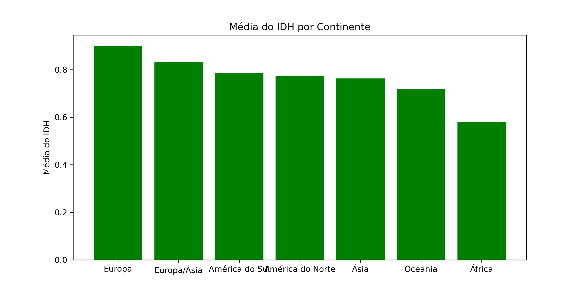
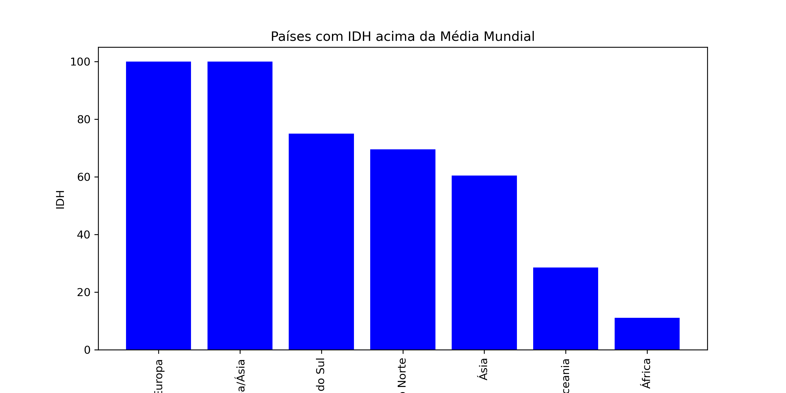
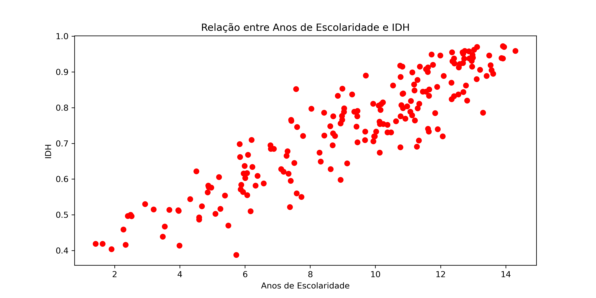
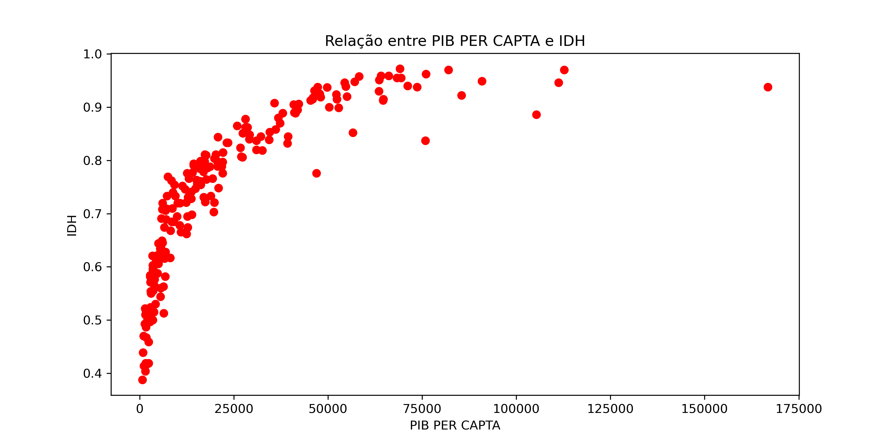

# 📊 Análise do IDH Global - Relatório de Desenvolvimento Humano 2023

<div align="center">

<p align="center">
  
  
  
  
  
</p>

<p align="center">
  <strong>Análise exploratória de dados sobre o Índice de Desenvolvimento Humano (IDH) mundial</strong>
</p>

<p align="center">
  <em>Projeto desenvolvido como parte do curso ADA + Artemísia</em>
</p>

---

</div>

## 📋 Sobre o Projeto

Este projeto apresenta uma **análise completa e visual** dos dados do Relatório de Desenvolvimento Humano de 2023, explorando indicadores socioeconômicos de 193 países distribuídos por todos os continentes.

### 🎓 Contexto Acadêmico

Este trabalho foi desenvolvido como **projeto de acompanhamento do curso ADA + Artemísia**, aplicando conceitos de:
- 📊 Análise exploratória de dados
- 🐍 Programação em Python
- 📈 Visualização de dados
- 🧹 Tratamento e limpeza de datasets

### ✨ Destaques

- 🌍 Análise de 193 países em 7 continentes
- 📈 Visualizações interativas e informativas
- 🔍 Correlações entre IDH, educação e PIB per capita
- 📊 Comparações continentais detalhadas
- 💾 Dados tratados e prontos para uso

---

## 🛠️ Tecnologias

<div align="center">


</div>

### 🔧 Stack Principal

```
📦 Bibliotecas Utilizadas
 ┣ 🐼 Pandas - Manipulação e análise de dados
 ┣ 📊 Matplotlib - Visualizações e gráficos
 ┣ 📓 Jupyter Notebook - Ambiente de desenvolvimento
 ┗ 📁 Openpyxl - Leitura de arquivos Excel
```

---

## 📂 Estrutura do Projeto

```
📁 analise-idh-global/
│
├── 📄 tratar_dados.ipynb                          # Notebook principal com análises
├── 📄 HDR25_Statistical_Annex_Tables_1-7.xlsx     # Dataset original (UNDP)
├── 📄 tabela_idh_por_pais_e_continente.csv        # Dados processados
│
├── 📁 img/                                        # Visualizações geradas
│   ├── media_IDH_continente.png
│   ├── paises_IDH_acima_media.png
│   ├── relacao_escolaridade_IDH.png
│   └── relacao_PIB_IDH.png
│
└── 📄 README.md                                   # Você está aqui! 😊
```

---

## 🎯 Análises Realizadas

<table>
  <tr>
    <td align="center">📊</td>
    <td><strong>Média de IDH por Continente</strong><br/>Comparação global do desenvolvimento humano</td>
  </tr>
  <tr>
    <td align="center">🌍</td>
    <td><strong>Distribuição Acima da Média</strong><br/>Percentual de países com IDH superior à média global</td>
  </tr>
  <tr>
    <td align="center">🎓</td>
    <td><strong>Correlação IDH x Educação</strong><br/>Relação entre anos de escolaridade e desenvolvimento</td>
  </tr>
  <tr>
    <td align="center">💰</td>
    <td><strong>Correlação IDH x PIB per capita</strong><br/>Impacto da riqueza econômica no desenvolvimento</td>
  </tr>
</table>

---

## 📊 Principais Descobertas

### 🥇 Ranking de IDH Médio por Continente

| Posição | Continente | IDH Médio |
|---------|-----------|-----------|
| 1º | 🇪🇺 Europa | 0.903 |
| 2º | 🌏 Europa/Ásia | 0.838 |
| 3º | 🌎 América do Sul | 0.785 |
| 4º | 🌍 América do Norte | 0.773 |
| 5º | 🌏 Ásia | 0.763 |
| 6º | 🏝️ Oceania | 0.719 |
| 7º | 🌍 África | 0.577 |

### 📈 Insights Importantes

- ✅ **Europa lidera** com quase todos os países acima da média global
- 📚 Existe uma **correlação positiva forte** entre educação e IDH
- 💵 O PIB per capita tem impacto no IDH, mas não é o único fator
- 🌍 Apenas **11% dos países africanos** estão acima da média mundial

---

## 🚀 Como Executar

### Pré-requisitos

```bash
# Certifique-se de ter Python 3.x instalado
python --version

# Instale as dependências
pip install pandas matplotlib openpyxl jupyter
```

### Executando o Projeto

```bash
# Clone o repositório
git clone git@github.com:nataliaberbetviana/analise-idh-global.git

# Entre na pasta do projeto
cd analise-idh-global

# Inicie o Jupyter Notebook
jupyter notebook tratar_dados.ipynb
```

### 📁 Usando os Dados Processados

```python
import pandas as pd

# Carregue os dados prontos
df = pd.read_csv('tabela_idh_por_pais_e_continente.csv', sep=';')

# Explore os dados
print(df.head())
print(df.describe())
```

---

## 📸 Visualizações

<div align="center">

### 📊 Média de IDH por Continente


### 🌍 Percentual Acima da Média Global


### 📈 Correlações
<div>
  
  
</div>

</div>

---

## 📊 Dataset

### 🔍 Variáveis Analisadas

| Campo | Descrição | Tipo |
|-------|-----------|------|
| **País** | Nome do país | String |
| **IDH** | Índice de Desenvolvimento Humano (0-1) | Float |
| **ESCOLARIDADE** | Anos médios de escolaridade | Float |
| **PIB PER CAPITA** | PIB per capita em dólares | Float |
| **Continente** | Região geográfica | String |

### 📚 Fonte dos Dados

**Organização:** UNDP (United Nations Development Programme)  
**Relatório:** Human Development Report 2023  
**Países Analisados:** 193  
**Ano de Referência:** 2023

---

## 🔄 Processo de Tratamento

```python
# Etapas de limpeza realizadas:
1️⃣ Normalização dos nomes dos países (lowercase)
2️⃣ Remoção de pontuação excessiva
3️⃣ Padronização de espaços
4️⃣ Merge com dados geográficos
5️⃣ Validação de valores nulos
```

---

## 💡 Possíveis Extensões

- [ ] 📈 Análise temporal (comparação com anos anteriores)
- [ ] 🗺️ Mapa interativo com visualização geográfica
- [ ] 🤖 Modelo de Machine Learning para previsão de IDH
- [ ] 📱 Dashboard interativo com Streamlit/Dash
- [ ] 🔍 Análise de outliers e casos especiais

---

## 🎓 Sobre o Curso ADA + Artemísia

Este projeto faz parte da minha jornada de aprendizado no **programa ADA + Artemísia**, focado em:

- 💻 Desenvolvimento de habilidades em análise de dados
- 🚀 Aplicação prática de conceitos de programação
- 📊 Visualização e interpretação de dados reais
- 🌱 Impacto social através da tecnologia


---

## 📬 Contato

<div align="center">

### 💬 Gostou do projeto? Vamos conversar!

<p>
  <a href="https://www.linkedin.com/in/nataliaberbetviana" target="_blank">
    
  </a>
  <a href="mailto:nabevia@gmail.com">
    
  </a>
  <a href="https://github.com/nataliaberbetviana" target="_blank">
    
  </a>
</p>

</div>

---

## 📝 Licença

Este projeto está sob a licença MIT. Os dados são de domínio público (UNDP).

---

<div align="center">

### ⭐ Se este projeto foi útil para você, deixe uma estrela!

**Desenvolvido com 📊 e ☕ para análise de dados**

<p>
  <strong>Projeto ADA + Artemísia | 2025</strong>
</p>

<sub>Última atualização: Outubro 2025</sub>

</div>

---

## 🙏 Agradecimentos

- **ADA + Artemísia** - Pelo programa de formação em tecnologia
- **UNDP** - Pelos dados do Relatório de Desenvolvimento Humano 2023
- **Comunidade Python** - Pelas excelentes bibliotecas de análise de dados
- **Instrutores e colegas** - Pelo suporte e aprendizado colaborativo
- **Você** - Por visitar este projeto!